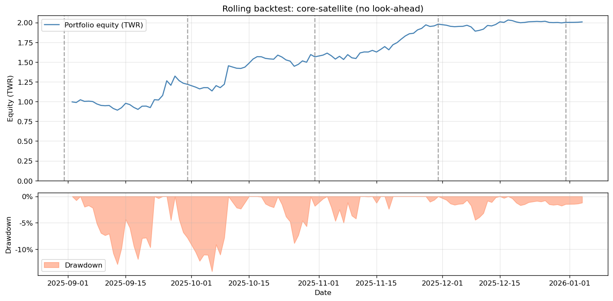

## Multi-Trader Following Strategy on Hyperliquid

This repository implements a research pipeline and backtest for a **multi-trader following strategy** on the Hyperliquid perpetual futures exchange. The goal is to:

- Clean and aggregate historical account PnL / equity data
- Engineer robust per-trader features (return distribution, drawdown, capacity sensitivity, activity, etc.)
- Profile traders via **UMAP + HDBSCAN** into style clusters
- Build a **core–satellite portfolio** of traders with risk-parity weights and simple capacity caps
- Run a **rolling, no-look-ahead backtest** that only uses information available at each rebalance date

The repository structure is refactored so that all reusable logic lives in `src/`, with thin scripts and a single `main.py` pipeline entrypoint.

---

### 中文简介

本项目实现了一个面向 **Hyperliquid 永续合约市场** 的「多交易员跟单」研究与回测框架，核心目标是：

- 将原始账户权益/盈亏数据整理为可分析的日度收益序列
- 构建稳健的交易员画像特征（收益分布、回撤、活跃度、容量敏感性等）
- 通过 **UMAP + HDBSCAN** 将交易员按风格聚类
- 构建 **Core–Satellite（核心/卫星）** 的多交易员组合，并在层内做风险平价分配，同时加入简化的容量约束
- 进行 **rolling、no-look-ahead（无前视）** 的滚动回测：每次调仓只使用调仓日前可获得的信息

下面是本项目 rolling 回测生成的权益曲线与回撤（图中标注了再平衡日期）：



---

### 1. Project Structure

- `main.py`  
  High-level pipeline entrypoint. Runs the full workflow:
  1. Raw CSV → daily returns + per-trader performance
  2. Feature engineering → `trader_features.csv`
  3. Export per-trader equity curves
  4. Profiling (filtering, UMAP, HDBSCAN, cluster profiles, best-trader curves)
  5. Rolling core–satellite backtest (step 5)

- `src/`
  - `performance.py` – compute per-trader daily returns and summary statistics (TWR, annualised return/vol, Sharpe, IRR, max drawdown, etc.)
  - `features.py` – feature engineering from daily returns and equity; also per-window features used by the rolling backtest.
  - `profiling.py` – profiling utilities:
    - load & filter `trader_features.csv`
    - standardisation
    - UMAP embedding
    - HDBSCAN clustering
    - cluster profiles & strategy-type tags
    - risk-parity helpers and simple capacity caps
  - `dataio.py` – data I/O helpers (safe filenames, load/export per-trader equity curves).
  - `backtest.py` – rolling **core–satellite** backtest with no look-ahead:
    - expanding or fixed lookback window
    - per-window feature computation
    - clustering and Core/Satellite classification
    - risk parity within Core and within Satellite
    - mapping cluster weights to **top-N traders per cluster**
    - turnover-based cost model (fees + slippage)
  - `plotting.py` – shared plotting utilities:
    - portfolio equity + drawdown
    - rolling backtest with rebalance markers
    - best-trader-per-cluster equity curves
    - profiling / style-drift summary figures

- `scripts/`  
  Small, script-style entrypoints that call into `src.*` modules (one script per step).

- `data/`
  - `raw/` – raw input CSV from the problem statement (NOT tracked in git).
  - `processed/` – all generated intermediate and backtest outputs:
    - `trader_daily_returns.csv`
    - `trader_performance_raw.csv`
    - `trader_features.csv`
    - `trader_equity_curves/` (one CSV per trader)
    - profiling step1–5 outputs
    - rolling backtest outputs (weights, curve, report, stats)

- `output/`
  - `figures/` – all PNG figures (profiling and rolling backtest).
  - `reports/` – textual backtest reports.

- `jupyternotebooks/`
  Exploratory notebooks for data quality checks and feature exploration. These are not required to run the main pipeline, but useful for interactive analysis.

---

### 2. Installation

This project assumes **Python 3.10+**.

1. Create a virtual environment (recommended):

```bash
python -m venv .venv
source .venv/bin/activate  # on Windows: .venv\Scripts\activate
```

2. Install dependencies:

```bash
pip install -r requirements.txt
```

Key libraries:

- `numpy`, `pandas`
- `scikit-learn`
- `umap-learn`
- `hdbscan`
- `matplotlib`

---

### 3. Configuration

The main configuration lives in `config.yaml`. Key sections:

- **data**
  - `raw_dir`: directory containing the raw CSV (e.g. `data/raw`).
  - `processed_dir`: where all intermediate CSVs will be written (e.g. `data/processed`).

- **output**
  - `figures_dir`: directory for PNG figures.
  - `reports_dir`: directory for textual reports.

- **backtest**
  - `trading_days_per_year`: typically 252.
  - `min_days`: minimum number of days within a window for a trader to be considered.
  - `lookback_days`: 0 for expanding window, or a fixed lookback in calendar days.
  - `rebalance_freq`: Pandas offset alias (e.g. `"ME"` for month-end).
  - `core_ratio`: target weight of Core layer in the core–satellite mix.
  - `min_cluster_size`: HDBSCAN `min_cluster_size`.
  - `top_traders_per_cluster`: number of top traders (by Sharpe) to hold per cluster.

- **profiling**
  - `core_std_threshold`: volatility threshold used to classify Core vs Satellite clusters.
  - `max_dd_exclude`: clusters with median max drawdown beyond this are excluded.

- **market / fees / slippage / capacity**
  - High-level assumptions for Hyperliquid:
    - fee rates in basis points (taker + maker)
    - a simple fixed slippage model in bps
    - portfolio-level capacity constraints (e.g. `max_weight_per_trader`)
  - These are only used in the backtest (no live trading code here).

---

### 4. Running the Full Pipeline

1. Place the raw CSV from the ArkStream problem statement into `data/raw/` and name it consistently with `main.py` (by default: `笔试题数据包.csv`).

2. Adjust `config.yaml` if your directory layout differs.

3. Run:

```bash
python main.py
```

This will:

- compute per-trader daily returns and performance summary tables
- build `trader_features.csv`
- export one equity curve per trader into `data/processed/trader_equity_curves/`
- run the profiling pipeline (UMAP + HDBSCAN + cluster profiles + best-trader curves)
- run the rolling core–satellite backtest and generate:
  - `data/processed/profiling_step5_rolling_weights.csv`
  - `data/processed/profiling_step5_rolling_curve.csv`
  - `data/processed/profiling_step5_rolling_rebalance_stats.csv`
  - `output/reports/profiling_step5_rolling_report.txt`
  - `output/figures/profiling_step5_rolling_fig.png`

---

### 使用说明（中文）

1. 将题目给的原始数据文件放到 `data/raw/`（默认文件名为 `笔试题数据包.csv`）。
2. 根据需要调整 `config.yaml`（例如 `min_days`、`min_cluster_size`、`top_traders_per_cluster` 等）。
3. 运行：

```bash
python main.py
```

你会在 `data/processed/` 里看到中间结果与回测输出，在 `output/figures/` 和 `output/reports/` 里看到图和报告。

---

### 5. Interpretation of Results

The rolling backtest is **explicitly no-look-ahead**:

- At each rebalance date:
  - Features and clustering only use historical data up to that date.
  - Core/Satellite classification and risk-parity weights are computed using only past information.
  - Top-N traders per cluster are selected based on features computed up to the cutoff.
  - Forward PnL uses returns after the rebalance date only.

The final equity curve and statistics (`profiling_step5_rolling_report.txt`) represent a hypothetical follow-the-trader strategy under these assumptions, including simple estimates of trading fees and slippage based on portfolio turnover.

The sample period in this repo is relatively short (several months), so the results should be interpreted as **a proof-of-concept**, not as a production-ready estimate of long-term performance. Extending the dataset and adding stricter out-of-sample testing would be the natural next steps.

---

### 6. Files Not Tracked in Git

For privacy and size reasons, the following input files are **ignored** and should not be committed:

- Original problem statement documents:  
  - `笔试题 - ArkStream量化研究员.docx`  
  - `笔试题 - ArkStream量化研究员.pdf`
- Raw data package from the problem:  
  - `data/raw/笔试题数据包.csv`

You should place these locally if you have them, but they are not required for understanding the code structure.

